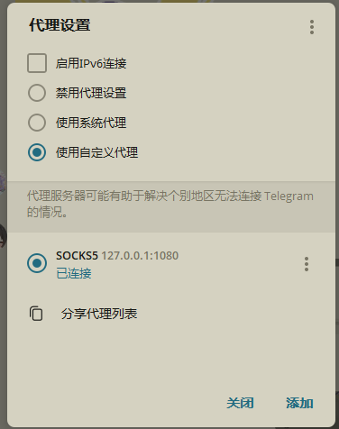

# fxproxy — Firefox IP Protection 独立落地代理

把 Firefox 内置的 **IP Protection**（Mozilla 给每个账号每月免费 **50GB** 的代理流量）
做成一个可独立运行的落地代理：本地起 **SOCKS5 + HTTP** 代理，出口走 Mozilla 的
Fastly 节点（29 个国家可选）。

> ⚠️ 说明
> - 这是 **代理/落地节点**，不是翻墙工具。落地节点是 Mozilla 的 Fastly 出口（美/英/德等），
>   **中国大陆连不上、也不用于绕过审查**。典型用途：当一个干净的海外落地出口。
> - 依赖一个 **已登录的 Firefox 账号**。账号首次需要「入组」（enroll）到 IP Protection，
>   本工具的 `login` 会自动完成。
> - 仅供个人学习/自用，遵守 Mozilla 服务条款。

## 原理

```
refresh_token ──/oauth/token──▶ access_token(~24h)
access_token  ──GET /api/v1/fpn/token──▶ proxy pass JWT(~10min)
本地 SOCKS5/HTTP ──TLS──▶ <node>.m1.fastly-masque.net:2499
                          └─ CONNECT <target> + Proxy-Authorization: Bearer <JWT>
```

- **凭证链**：持久凭证是 apps/vpn 作用域的 `refresh_token`。运行期只用它换 access_token，
  再换短时效（约 10 分钟）的 proxy pass JWT，全程纯 HTTPS，**机房 IP 无墙、无需再登录**。
- **落地**：proxy pass JWT 作为 `Proxy-Authorization: Bearer` 发给 Fastly 节点的
  标准 HTTPS `CONNECT` 代理（端口 2499）。
- **服务器列表**：公开于 Remote Settings 的 `vpn-serverlist`，按国家挑节点。
- proxy pass 会在过期前自动续期。

## 安装

```bash
pip install -e .          # 或 pip install -r requirements.txt
```

Python ≥ 3.10。

## 快速开始

### Windows（PowerShell）

```powershell
# 1) 克隆并进目录
git clone https://github.com/Yu9191/firefox.git
cd firefox

# 2) 安装（含依赖 aiohttp）
pip install -e .          # 若提示 pip 不是命令：python -m pip install -e .

# 3) 打开可视化面板（自动开浏览器 http://127.0.0.1:8765）
fxproxy web               # 或 python -m fxproxy web
```

**首次没有凭证**：面板顶部会有「登录 / 入组」表单——填 Firefox 邮箱+密码（或 sessionToken）
点「登录并保存」即可，凭证会自动写进 `config.json`，以后不用再登录。

> 已经有 `refresh_token`（比如别人给你）？也可以手动写配置跳过登录：
> ```powershell
> $dir = "$HOME\.config\fxproxy"
> New-Item -ItemType Directory -Force -Path $dir | Out-Null
> @'
> { "refresh_token": "PASTE_YOUR_REFRESH_TOKEN", "country": "US",
>   "host": "127.0.0.1", "http_port": 8080, "socks_port": 1080, "failover": 3 }
> '@ | Set-Content -Encoding utf8 "$dir\config.json"
> ```

### macOS / Linux

```bash
git clone https://github.com/Yu9191/firefox.git && cd firefox
pip install -e .
fxproxy login --email you@example.com      # 首次：换取并保存 refresh_token
fxproxy web                                # 打开控制面板
```

面板运行后，把浏览器/系统代理指到 `127.0.0.1:8080`(HTTP) 或 `127.0.0.1:1080`(SOCKS5) 即可。

## 使用

### 0. 可视化控制面板（最省事）

```bash
fxproxy web        # 启动后自动打开 http://127.0.0.1:8765
```

**新用户没有凭证时**，面板顶部会显示「登录 / 入组」表单，拿凭证有三种方式：

- **浏览器登录（推荐新用户）**：点「浏览器登录」按钮，工具弹出一个真实浏览器窗口，
  你在里面正常登录（或注册）Firefox 账号——真实浏览器能过 Mozilla 的人机验证/风控；
  登录完成后工具自动抓取凭证、入组并保存。需要先装一次浏览器组件：
  ```bash
  pip install playwright
  python -m playwright install chromium
  ```
- **直接粘贴 refresh_token**：已经有凭证就选这个，贴进去即可，任意网络都能用。
- **邮箱+密码 / sessionToken**：脚本直连登录接口，**常被 Mozilla 风控拦（406/非 JSON）**，不推荐。

> **部署到服务器**：登录/注册接口被 Mozilla 按 IP 封（机房/VPS → 406），服务器上无法直接登录/注册
> （换新邮箱也没用，封的是 IP 不是账号）。正确做法是先在**住宅 IP**（家里宽带/手机）上登录一次拿到
> `refresh_token`，它是**便携**的——换 token / VPN 接口都不封机房 IP。用 `fxproxy token` 打印出来，
> 复制到服务器的 `~/.config/fxproxy/config.json` 即可，服务器端无需再登录：
>
> ```bash
> fxproxy token        # 打印 refresh_token + 服务器写入命令；纯脚本用 `fxproxy token -q`
> ```

保存成功后接着下拉选出口国家、一键**启动/停止**代理、实时看**配额剩余**、点「测试出口 IP」验证落地。
（不想自动开浏览器加 `--no-open`，改端口加 `--web-port 9000`。）

也可以用交互式命令行菜单——直接运行、不带参数即进入，按数字选指令：

```bash
fxproxy            # 1 登录 / 2 配额 / 3 国家 / 4 起代理 / 5 web 面板 / 6 退出
```

登录时可选「邮箱+密码」或直接「粘贴 sessionToken」。也可用下面的子命令非交互运行。

### 1. 首次引导凭证（`login`）

`login` 把「邮箱+密码」或「sessionToken」换成持久 `refresh_token` 并自动入组，
结果写入 `~/.config/fxproxy/config.json`（0600 权限）。

```bash
# 方式 A：邮箱 + 密码（注意：FxA 登录接口对机房 IP 有风控 406，
#          请在住宅网络/本机跑，或改用方式 B）
fxproxy login --email you@example.com          # 会交互式提示输入密码
fxproxy login --email you@example.com --password 'xxxx' --country US

# 方式 B：从真实 Firefox 里导出的 sessionToken（任何 IP 都能用）
fxproxy login --session-token <hex-sessionToken> --country US
```

> **为什么支持 sessionToken**：Mozilla 对数据中心/VPS 的 IP 封了 `/account/login`（返回 406），
> 但 OAuth 与 `/api/v1/fpn/*` 不封。所以在 VPS 上用方式 B 最稳：在本机 Firefox 登录后，
> 从「浏览器工具箱 → 存储/网络」里取出 sessionToken 交给工具即可。

### 2. 看配额 / 看可用国家

```bash
fxproxy status      # uid、每月配额(50GiB)、剩余流量/已用/重置时间、是否订阅
fxproxy servers     # 列出所有可选国家
```

### 3. 起代理

```bash
fxproxy run --country US            # 默认监听 127.0.0.1:8080(HTTP) / 1080(SOCKS5)
fxproxy run --country GB --http-port 3128 --socks-port 1081
fxproxy run                         # country 留空 = 任意国家随机
fxproxy run --country US --failover 5   # 每条连接最多试 5 个节点
```

**多节点故障切换**：每条连接会在所选国家的节点池里随机挑 `failover` 个节点依次尝试，
某个 Fastly 节点连不上/CONNECT 失败时自动切下一个（默认 3，可用 `--failover` 或配置项调整）。

使用：

```bash
curl -x http://127.0.0.1:8080 https://api.ipify.org        # HTTP(CONNECT)
curl --socks5-hostname 127.0.0.1:1080 https://api.ipify.org # SOCKS5
```

### 4. 在 Telegram 里用（已实测可用）

Telegram 支持 SOCKS5 代理，直接指到本工具即可让 TG 走海外出口。以桌面版为例：
**设置 → 高级 → 连接类型 → 使用自定义代理 → 添加 SOCKS5**，服务器 `127.0.0.1`、端口 `1080`
（不填账号密码），保存启用后显示「已连接」即成功——聊天/图片/文件都会走 Mozilla 的海外 IP。



> - 只走 **TCP**：TG 的**语音/视频通话是 UDP，不走代理**（收发消息、文件正常）。
> - 手机上的 TG 连不到电脑的 `127.0.0.1`，需把工具部署到**服务器**（config 里 `host` 设 `0.0.0.0`、
>   开放端口），手机 TG 再填 `服务器IP:1080`；对外开放建议加防火墙/鉴权。

## 配置文件

`~/.config/fxproxy/config.json`（可用 `-c/--config` 或环境变量 `FXPROXY_CONFIG` 指定路径）：

```json
{
  "refresh_token": "…",
  "country": "US",
  "host": "127.0.0.1",
  "http_port": 8080,
  "socks_port": 1080
}
```

也可用环境变量 `FXPROXY_REFRESH_TOKEN` 覆盖 `refresh_token`（不落盘）。
`config.json` 含真实凭证，已在 `.gitignore`，不会被提交。

## 后台常驻（systemd）

仓库自带模板 `deploy/fxproxy@.service`（模板单元，`%i` = 运行用户）：

```bash
sudo cp deploy/fxproxy@.service /etc/systemd/system/
# 按需编辑 ExecStart 里的 --country、或用 FXPROXY_REFRESH_TOKEN 注入凭证
sudo systemctl daemon-reload
sudo systemctl enable --now fxproxy@$USER    # 开机自启并立即运行
sudo systemctl status fxproxy@$USER
journalctl -u fxproxy@$USER -f               # 看日志
```

凭证可放在该用户的 `~/.config/fxproxy/config.json`，或在 service 里用
`Environment=FXPROXY_REFRESH_TOKEN=…` 注入（不落盘）。

> 若只想临时后台跑：`nohup fxproxy run --country US >/tmp/fxproxy.log 2>&1 &`。

## 安全提示

- 默认只监听 `127.0.0.1`；若要对外/当公共落地，请自行加认证或防火墙（本工具不做鉴权）。

## 模块

| 文件 | 作用 |
|------|------|
| `fxproxy/guardian.py`    | Guardian API 客户端：refresh→access→proxy pass、配额、服务器列表 |
| `fxproxy/fxa_auth.py`    | 一次性凭证引导：登录/换 token、自助入组（enroll） |
| `fxproxy/proxyserver.py` | 本地 HTTP CONNECT + SOCKS5 服务，上游 TLS+CONNECT 到 Fastly 节点 |
| `fxproxy/config.py`      | 配置读写 |
| `fxproxy/webui.py`       | 本地可视化控制面板（aiohttp）：选国家/启停/配额/测出口 |
| `fxproxy/cli.py`         | 命令行入口（login / status / servers / run / web） |
